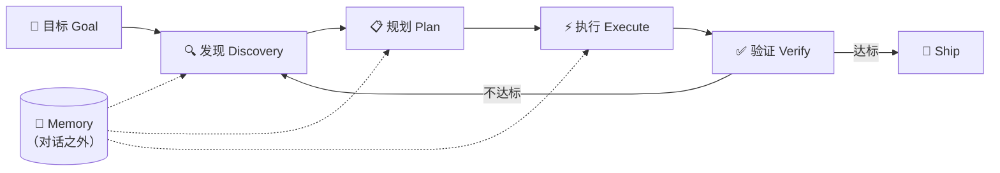

# AI Agent 开发规范与方法论

> 本文档定义一套以 AI Agent 为执行主体的全流程开发规范，覆盖沟通标准、编码自审、测试验收、质量门禁、循环工程与图谱工程。供 AI Agent 与人类协作者共同遵循。

---

## 〇、文档性质与使用条款

**定义**：本文件是一份**通用模板文档（Template）**，定义 AI Agent 全流程开发的方法论骨架与最低规范基线，而非针对某一具体项目的定制规范。

### 1. 文档定位

- 本文档是 **agents 模板**，所有章节均为跨项目通用的架构性约定。
- 用户将本文档放入具体项目后，它即成为该项目的 **开发规范起点**，需经项目适配后正式生效。
- 文档中的「定义」「核心原则」「门槛」「流程」属于**架构性内容**，是规范的骨架，不可随意删改。

### 2. AI 工具的适配义务

当本文档被放入项目后，接入的 AI 工具**必须**在首次使用前完成**项目适配性优化**，使其贴合当前项目的技术栈、规模与约束：

| 适配项 | 说明 | 示例 |
| --- | --- | --- |
| 技术栈对齐 | 将通用工具名替换为项目实际选型 | 「ESLint/Pylint」→ 项目实际使用的 lint 工具 |
| 门槛校准 | 根据项目阶段与团队规模调整量化指标 | 测试覆盖率 ≥80% → 早期项目可降至 ≥60%，需注明过渡计划 |
| 流程裁剪 | 按项目实际工作流保留或简化章节 | 单人项目可简化「PR 评审」为「自审提交」 |
| 术语本地化 | 统一为项目内既有命名与约定 | 命名风格、目录结构、错误类型等 |
| 依赖完整性 | 适配时不得破坏章节间的显式依赖关系（见各章节「⚠ 依赖」标注） | 修改第四节版本号规则时，必须同步校验第五节自增映射是否仍可执行 |

### 3. 修改红线（架构性内容保护）

适配性优化**仅限填充与细化**，**不得违背本文档的总体架构性约定**。以下内容属于受保护范围，AI 工具不得自行变更：

**方法论层**：
- 总纲的**核心原则**（目标前置 / 小步快跑 / 时时有记录 / 独立验证 / 不确定性上报 / 上下文边界 / 不可逆操作审批 / 自审）
- 各章节的**定义**与**核心原则**
- CRTSE **五要素结构**及其完整性

**流程层**：
- 三步自审法的**审查顺序与三层结构**（允许按变更类型匹配审查轮次）
- 测试覆盖的 **TDD 流程**（先测试后代码——写测试→跑红→实现→跑绿→重构，允许简化「跑红」步骤）
- Loop Engineering 的**核心循环**（Goal→Discovery→Plan→Execute→Verify→Ship/Iterate）与五大设计杠杆
- 质量护栏的**四大类型**与**全流程卡点**框架

**规范层**：
- **版本号规则必须是确定的、可机器判定的**（SemVer 为默认推荐，不强制）
- **提交信息必须结构化，包含变更类型和简短描述**（Conventional Commits 为默认推荐，不强制）
- **代码结构理解机制**的必要性（Graph Engineering 为高阶实现——中大型项目强制，小型项目允许裁剪）

> 允许：在架构骨架内填充项目细节、动态调整量化门槛、裁剪不适用的子项。
> 禁止：删除整个章节、改变方法论的阶段顺序、绕过验收驱动的核心逻辑、让 AI 模型自行评价自身产出。

### 4. 修改权限请求机制

若 AI 工具在适配过程中判断**必须进行架构性修改**才能适配项目（例如项目范式与某章节根本冲突），**不得自行修改**，必须执行以下流程：

完整权限请求流程（团队项目/正式项目，5 步）：
1. **停止修改**，不得擅自删改受保护内容；
2. **向用户说明冲突点**：指出哪一章节、哪一条架构性约定与项目实际情况冲突；
3. **提出修改方案**：给出建议的调整方向、理由及潜在影响；
4. **请求用户授权**：明确告知"此修改属于架构性变更，需要您确认"，等待用户明确同意后方可执行；
5. **记录变更**：获得授权后执行的架构性修改，须在项目适配版本中标注变更原因与授权来源，留痕可追溯。

> 📎 **简化模式**：单人项目或 prototype 阶段可采用核心 3 步——停止修改 → 向用户说明冲突并请求授权 → 记录变更。跳过完整方案阐述和来源追溯，但「获得用户确认」这一步不得简化。

### 5. 适配产出要求

适配完成后的文档必须：

- 保留原文档的**章节编号与标题结构**，便于对照模板追溯；
- 在文档头部或适配说明区**必须**记录：适配日期、适配人/Agent、主要调整项、是否含架构性变更（及授权记录）；
- 对调整过的量化门槛，**必须**注明原模板值与适配值，以及调整理由；
- 在速查表中**必须**标注哪些章节经过适配修改（见末尾「规范全景速查」表的「适配标记」列）。

---

## 一、总纲：全流程 AI 驱动开发

**定义**：以 AI Agent 为执行主体，贯穿软件全生命周期（需求 → 设计 → 编码 → 自审 → 测试 → 提交 → 发布）的开发模式。人类从"逐行执行者"退到"设目标、定边界、验结果"的位置。

| 角色 | 职责 |
| --- | --- |
| **人类** | 设定目标与验收标准、定义边界与约束、最终验证与决策 |
| **AI Agent** | 拆解任务、生成代码、自审重构、编写测试、迭代修复、记录进度 |

**核心原则**：

- **目标前置**：每次开工先把目标和验收标准说清楚，验收必须是可机器判定的 0/1 信号。不可由 AI 自行判断"是否做完"。
- **小步快跑**：每次只做最小可验证的改动，跑通验证再扩展。
- **时时有记录**：任务进度、设计决策、迭代摘要全部落盘，独立于对话存在。
- **独立验证**：执行与审查必须由不同实例/模型承担。不允许 AI 自行评价自身产出——验收信号必须来自外部确定性检查（测试/类型检查/lint），Code Review 应由独立模型或人类执行。
- **不确定性上报**：AI 在执行任何任务时，若对需求理解、方案可行性、工具用法、依赖版本的置信度低于阈值（默认 80%），必须主动向人类报告不确定项，不得自行猜测填充。Loop 内连续两次迭代未取得进展时，必须暂停并上报。
- **上下文边界**：AI 的操作范围严格限定在当前任务所需的最小文件集和符号集。禁止对未在任务描述中提及的模块进行任何形式的修改（包括重构、格式化、注释增删），除非先请求授权并获得确认。
- **不可逆操作审批**：涉及生产环境变更、数据库写操作、权限修改、文件删除、对外发布等不可逆操作，AI 不得自行执行。必须生成变更方案和影响评估后，等待人类明确确认方可执行。本原则优先于一切效率优化诉求。
- **自审**：对产出代码执行 Code Review 后再提交。审查轮次和深度按变更类型匹配——简单变更可简化，架构级变更必须完整三轮。
- **关联**：「时时有记录」与第十节 Loop Engineering 的「Memory 活在对话之外」是同一理念的两个层次——前者是**方法论要求**（必须落盘），后者是**技术实现**（文件 / 结构化状态记录），AI 工具不得只取其一。「独立验证」与第十节「验收信号必须是确定性检查」是同一原则的两个表述。

---

## 二、CRTSE 提示词框架：人机协作沟通标准

**定义**：编写 AI 提示词的五要素结构（Context-Role-Task-Standards-Examples），确保 AI 输出可预期、可复用、可复现。这是与 AI 协作的基础方法论。

| 要素 | 含义 | 示例 |
| --- | --- | --- |
| **C** — Context 上下文 | 交代技术栈、项目类型、当前架构、相关约束 | "本项目为 NestJS + TypeORM 后端，PostgreSQL 数据库" |
| **R** — Role 角色 | 指定 AI 扮演的专业身份 | "你是一位资深后端工程师，精通 TypeScript 与分布式系统" |
| **T** — Task 任务 | 明确说明需求，一次提示词只对应一个核心任务 | "为 UserService 新增分页查询方法，支持按创建时间倒序" |
| **S** — Standards 标准 | 定义类型安全、错误处理、代码风格等质量要求 | "全程类型安全，异常统一抛 BusinessException，函数行数 ≤50" |
| **E** — Examples 示例 | 提供现有代码库中的优秀模式或函数签名作为参考 | "参考 src/user/user.service.ts 中 findById 的写法" |

> 通过这套标准化工作流，可将 AI 从"一次性代码生成器"升级为深度参与软件生命周期的"智能开发助手"，大幅提升开发效率与代码质量。

> 🔗 **贯穿声明**：CRTSE 是全文的**沟通标准层**，后续所有章节（Code Review、测试覆盖、Loop Engineering 等）中凡涉及「给 AI 下达指令」的场景，均应遵循 C-R-T-S-E 五要素组织提示词。例如让 AI 执行 Code Review 时，应同时交代 R（扮演架构师）、T（审查哪段代码）、S（审查标准）。AI 工具在执行任何章节任务前，应先以 CRTSE 框架构造指令。

---

## 三、任务进度跟踪：时时有记录，事事有记录

**定义**：用结构化文档实时记录任务状态、决策与阻塞，保证任何时刻、任何接手者（人或 Agent）都能追溯项目进展。

**记录要求**：

- 每个任务记录：任务名、当前状态（待办 / 进行中 / 已完成 / 阻塞）、负责人、起止时间、产出物。
- 每个决策记录：做了什么决定、为什么这么决定、否定了哪些方案。
- 每个阻塞记录：卡在哪、影响范围、待解决事项与负责人。

**建议格式**：

```markdown
### 任务：[任务名称]
- 状态：进行中
- 负责人：Agent / 人工
- 开始：2026-07-27
- 决策记录：选用方案 A，因性能更优；放弃方案 B，因依赖过重
- 阻塞：等待第三方 API 权限审批
- 下一步：权限到位后接入联调
```

---

## 四、版本迭代记录：版本号 + 摘要

**定义**：在项目根目录维护版本迭代文档，每次迭代记一行摘要，格式为「版本号 — 摘要」，简洁明了即可。

**文件位置**：项目根目录，如 `CHANGELOG.md` 或 `VERSION_ITERATION.md`。

**记录格式**：

```markdown
## 版本迭代记录

| 版本号 | 日期 | 摘要 |
| --- | --- | --- |
| v0.1.0 | 2026-07-27 | 初始化项目骨架，完成用户模块基础 CRUD |
| v0.1.1 | 2026-07-28 | 修复用户分页 off-by-one，补齐单元测试 |
| v0.2.0 | 2026-07-30 | 新增权限模块，接入 RBAC 鉴权 |
```

**版本号规则**：`主版本.次版本.修订号`

- **主版本**：不兼容的 API 变更
- **次版本**：向下兼容的功能新增
- **修订号**：向下兼容的缺陷修复

> SemVer（语义化版本）为默认推荐方案。项目适配时可采用其他确定的、可机器判定的版本号规则（如日历版本 `2026.07.27`、Git SHA 派生版本），只要保证版本号能反映变更语义即可。替换版本规则不影响其他章节的架构性约定。

---

## 五、自动化 Git 提交与版本号自增

**定义**：每完成一个任务节点自动提交 Git，并按版本号规则递增版本号，保证代码与版本记录同步。

**自动化规则**：

1. **触发时机**：单个任务完成且通过自审与测试后，自动执行 `git add` + `git commit`。
2. **提交信息**：提交信息必须结构化，包含变更类型和简短描述。推荐类型：
    - `feat`（新功能）/ `fix`（修复）/ `refactor`（重构）/ `test`（测试）/ `docs`（文档）/ `chore`（杂项）
    - 示例：`feat(user): 新增分页查询接口`
    - Conventional Commits 为默认推荐格式，适配时可采用项目内部约定的结构化提交规范，但不得退化为无结构的自由文本。
3. **版本自增**（仅当节四启用版本号规则时）：
    - `feat` → 次版本号 +1
    - `fix` / `refactor` → 修订号 +1
    - 破坏性变更 → 主版本号 +1
4. **关联记录**：提交后同步更新版本迭代文档（见第四节）。
5. **可追溯性**：每次提交必须在信息中标注——生成模型/版本、触发指令摘要或引用编号、相关 Loop 迭代轮次号。提交粒度为单次任务，禁止将多个 AI 生成批次合并为一个无追溯信息的单次提交。

> ⚠ **依赖声明**：本节的版本自增规则依赖第四节的版本号规则。若适配时修改版本号规则（如从 SemVer 改为日期版本号），必须同步重定义本节的 type→版本号映射逻辑，否则自增链条将断裂。此修改属于架构性变更，须按条款第四条请求用户授权。

---

## 六、Code Review 三步自审法

**定义**：以资深架构师视角对自己的代码进行性能 → 逻辑架构 → 健壮性三轮自审，在提交前完成"自检 → 找茬 → 重构 → 加固"。

> 💡 **灵活匹配**：审查轮次和深度可按变更类型调整——简单变更（如修 typo、单行逻辑调整）可简化为一轮全面审查；架构级变更（模块拆分、数据模型变更、接口重构）必须执行完整三轮。三轮的顺序（性能→架构→健壮性）不变，但每轮的深度和时长由 AI 按变更影响面自主裁量。

> 这不是别人审你，是**自己 review 自己**——把问题拦截在提交之前。

### 第一步：性能审查

- 检查慢查询、循环嵌套、重复计算
- 检查 IO / DB 调用是否冗余、是否可批量化
- 评估时间 / 空间复杂度是否合理

> 架构师视角的性能自检。

### 第二步：逻辑与架构优化审查

- 发现热点、瓶颈后，审查**是否需要加缓存**、加在哪一层
- 审查逻辑是否冗余、是否可抽象、是否可异步化
- 审查模块边界是否清晰、是否高内聚低耦合

> 设计层面的优化 review。

### 第三步：健壮性与规范审查

- 审查异常是否捕获、边界是否处理
- 检查空指针、并发安全、参数校验、日志规范
- 检查命名规范、注释完整性、代码风格一致性

> 工程质量与稳定性 review。

---

## 七、代码注释规范

**定义**：行内 / 模块 / 函数三级注释体系，记录设计理由、决策依据与避坑要点，确保代码可长期维护、可顺利接手。

### 必须级（架构性注释，AI 自审时强制检查）

1. **三级注释齐全**：规范编写行内注释 + 模块注释 + 函数注释，通俗易懂、不冗余、不写无意义废话。
2. **说明为什么**：每个核心函数 / 类必须明确写明——为什么这么设计、选用该方案的原因、相比其他方案的优劣。
3. **禁止 magic number**：关键变量、复杂算法、业务规则必须单独注释解释含义与用途；magic number 禁止裸写，需用常量定义并备注。
4. **标注依赖**：如有第三方库、工具类、接口依赖，需备注依赖版本、使用场景和替换适配方案。

### 推荐级（增强维护性，按需执行）

5. **记录设计思路**：全程记录整体架构与模块的设计思路、选型理由、决策依据。
6. **覆盖关键逻辑**：所有关键逻辑、特殊处理、边界场景都要加注释说明，避免后期看不懂。
7. **标注风险与约束**：标注后续迭代注意事项、依赖约束、兼容限制、潜在风险点和避坑要点。
8. **统一规范**：统一命名规范、缩进格式、模块化拆分，高内聚低耦合，便于后期扩展和接手维护。

---

## 八、测试覆盖

**定义**：分层测试策略与覆盖率门槛，以可机器判定的验收信号驱动开发收敛。测试不仅是质量保障，更是 Loop Engineering 中"循环何时停止"的客观靶子。

### 1. 测试金字塔

```
        /  E2E  \        少而精，覆盖核心用户路径
       / 集成测试 \       中等，覆盖模块间交互
      /  单元测试   \     多而快，覆盖函数级逻辑
```

- **单元测试**：数量最多、速度最快，覆盖单个函数 / 类的逻辑与边界。
- **集成测试**：覆盖模块间协作、数据库交互、API 契约。
- **E2E 测试**：数量最少，覆盖端到端核心业务流程。

### 2. 覆盖率门槛

| 层级 | 默认门槛 | 适配参考 |
| --- | --- | --- |
| 整体单元测试 | ≥ 80% | 原型阶段可降至 ≥60%，须注明逐步提升计划 |
| 核心业务模块 | ≥ 90% | 涉及金钱/安全/合规的模块不得低于此值 |
| 工具类 / 纯函数 | ≥ 95% | 接近纯函数，应尽可能 100% |
| E2E 关键路径 | ≥ 100%（核心用户流程每路径至少一条） | 每条核心路径至少一条正向用例 |

> 📎 **门槛使用说明**：以上为默认参考值，适配时**必须设定覆盖率目标**（没有目标的测试是不可靠的），但具体数值由项目按阶段、风险等级、团队资源动态确定。所有偏离默认值的调整须在适配记录中注明原值、调整值及理由。

### 3. 测试驱动开发（TDD）流程

1. **写测试**：先写失败的测试，明确预期行为
2. **跑红**：确认测试失败（证明测试有效）
3. **实现**：写最小代码让测试通过
4. **跑绿**：确认测试通过
5. **重构**：在测试保护下优化代码，保持绿色

### 4. AI 辅助测试要点

- AI 负责生成测试用例、补齐边界场景、跑测试读取结果并修复——但**验收信号必须由确定性检查给出**，不能让写代码的模型自己给自己打分。
- **验收标准即测试**：将 acceptance criteria 转为可执行测试，作为 Closed Loop 的收敛靶子。
- **测试即文档**：测试名应表达意图（如 `shouldReturnPaginatedUsersSortedByCreatedAtDesc`），让人读测试名就懂需求。

---

## 九、质量护栏（Quality Guardrails）

**定义**：在开发流程关键节点设置的自动化检查关卡，把团队"不能犯的错"写成可自动执行的规则，拦截低质量、不安全、不合规的代码进入主干 / 生产。一句话：**拦坏代码、护好质量**。

- **别名**：质量门禁、准入关卡、防护栏（DevOps / AI 场景常叫 guardrails）。
- **本质**：把经验变成规则，把规则变成自动化检查，卡在 CI/CD、PR、合并、发布前。
- **目标**：早发现、早拦截、低成本修复，避免小问题拖成线上事故。

### 1. 四大类型

| 类型 | 检查内容 | 典型工具 |
| --- | --- | --- |
| **代码质量** | 语法规范、圈复杂度、函数行数、重复率、覆盖率 | ESLint、Pylint、Prettier、Black |
| **安全** | OWASP Top10、SQL 注入、XSS、CSRF、密钥硬编码、依赖漏洞、**依赖引入审查**（包名验证/版本可达性/许可证兼容性/维护度评估） | Snyk、CodeQL、Trivy、npm audit |
| **合规与架构** | 命名规范、目录结构、依赖方向、分层约束、行业合规 | ArchUnit、dependency-cruiser |
| **流程与策略** | PR 必须评审、必须关联工单、禁止超大 PR、发布门槛、**不可逆操作门禁** | GitHub Branch Protection、CI 策略 |

### 2. 全流程卡点

| 阶段 | 卡点 | 动作 |
| --- | --- | --- |
| 写代码时 | IDE 实时提示 | lint、格式化实时拦截 |
| 提交时 | Git Hook（pre-commit） | 拦截不规范代码，阻止提交 |
| PR / MR 阶段 | CI 自动流水线 | 跑扫描、测试、评审，不达标不让合并 |
| 合并主干后 | 分支保护 | 再次门禁校验 |
| **不可逆操作前** | **人类确认门禁** | **数据库写/生产变更/权限修改/文件删除/对外发布——AI 生成方案后自动暂停，等待人类确认方可继续** |
| 发布 / 上线前 | 最终质量门 | 性能、安全、覆盖率全部达标方可发布 |

### 3. 与人工评审的区别

- **人工评审**：靠人看、慢、易遗漏、标准不一致。
- **质量护栏**：自动化、快、标准统一、100% 执行；人只关注架构 / 业务逻辑，解放精力。

> **质量护栏 = 把经验变成规则，把规则变成自动化检查，在错误流入下游前就拦住。**

---

## 十、Loop Engineering：工作循环工程

**定义**：把"发现问题 — 规划 — 执行 — 验证 — 再来一轮"的循环体执行者从**人**交给 **Agent**。人类只负责开头设定目标与验收标准，循环自己续上、自己收敛。

> 参考：[[00.收件箱/剪藏/Loop Engineering 到底是什么？看这一篇就够了]]

### 1. 核心循环

```
目标(Goal) → 发现(Discovery) → 规划(Plan) → 执行(Execute) → 验证(Verify)
                                                              ↓
                                                        达标 → Ship
                                                        不达标 → Iterate（回到 Discovery）
                                                              ↑
                                              Memory（活在对话之外，跨轮接力）
```



| 环节 | 说明 |
| --- | --- |
| **目标** | 由人类通过 `/goal` 设定一次——这是循环里人类**唯一必须做、也唯一不该交出去**的事 |
| **Discovery** | Agent 自主发现这一轮要做什么，不等人类逐条派活 |
| **Plan** | 把发现的事项拆成清晰、可执行的步骤 |
| **Execute** | 动手实现；可 fan-out 多个 Agent 并行处理独立子任务 |
| **Verify** | 检查目标是否达成——**最重要的一环**；验收条件必须是可机器判定的（lint、编译、单测、E2E） |
| **Ship / Iterate** | 达标交付；不达标则带着本轮暴露的问题回到 Discovery 再来一轮 |
| **Memory** | 进展记录在对话之外（文件 / 状态文档），下一轮无论哪个 Agent 来都能读到"现在到哪了" |

> 🔗 **关联**：Memory 是总纲「时时有记录」原则在循环工程中的技术落地——落盘对象包括第三节任务跟踪文档、第四节版本迭代记录等。两者必须保持一致，不得单独弱化任一方。

### 2. 五大设计杠杆

| 杠杆 | 含义 |
| --- | --- |
| **工具（Tools）** | Agent 能调用什么——决定它的能力边界 |
| **停止条件（Stopping）** | 何时允许退出：成功退出、迭代上限、预算上限、停滞检测 |
| **上下文管理（Context）** | 跨轮保留什么：压缩旧日志、剪枝无关上下文、结构化记录已尝试项 |
| **验证（Verification）** | 如何证明做完了：**优先确定性检查**，而非让模型给自己打分 |
| **护栏（Guardrails）** | 防止循环造成伤害：沙箱、最小权限凭证、预算封顶 |

### 3. Closed Loop 与 Open Loop

| 维度 | Closed Loop（闭环） | Open Loop（开环） |
| --- | --- | --- |
| 起点 | 有界目标 + 明确验收 | 一句话目标，方向由 Agent 自主展开 |
| 停止 | 验收达标即停，开销可控 | 靠外部预算上限兜底，开销难预估 |
| 探索面 | 窄，不给你意外惊喜 | 广，常发现事先没想到的方向 |
| 适用 | 交付场景：把确定的事在可预期开销内做完 | 探索场景：预算充裕，以发现为目的 |

> **实践建议：多数情况先从 Closed Loop 开始**，把一件目标清楚的事跑顺，再按需放开边界。

### 4. 关键机制

- **Self-prompting**：上一轮跑完后不由人想"下一步问什么"，而是让 Agent 根据已有进展自己写下一轮的 Prompt——循环自己续上。
- **Orchestrator（编排）**：掌管目标的 Agent，负责派活、汇总结果、决定 Ship 还是 Iterate。
- **Fan-out / Fan-in**：散出去是为了快（多 Agent 并行），收回来是为了不乱（统一收口汇总）。
- **Memory 活在对话之外**：把进度写入文件 / 结构化状态记录，独立于任何一次对话而存在；下一轮无论哪个 Agent 来跑都能读到"现在到哪儿了"。

---

## 十一、Graph Engineering：图谱工程

**定义**：将代码结构建模为可查询的知识图谱（节点 = 文件 / 符号 / 测试 / 基础设施，边 = 调用 / 导入 / 实现 / 引用 / 数据流），让 AI 通过遍历真实依赖关系而非猜测来理解代码。

> 📎 **适用范围**：代码知识图谱是**中大型项目的高阶实践**（建议条件：代码模块 >50 个或涉及多仓库协作）。小型项目（单仓库、模块 <20）可裁剪本节，不影响规范的整体一致性。裁剪时需在适配记录中注明"当前项目规模不适用"。中大型项目强制评估是否引入图谱机制，不可跳过决策直接忽略。

### 1. 为什么需要代码知识图谱

传统向量检索只能找到"文本相似"的片段，无法回答结构性问题。图谱把代码间的真实关系变成可遍历的边，让检索从"猜测"变成"确定"。

| Agent 的问题 | 向量检索 | 图谱遍历 |
| --- | --- | --- |
| "谁调用了 AuthService？" | 返回含相似文本的片段（有误报） | 沿 `CALLS` 反向遍历，精确命中 |
| "改这个函数会影响什么？" | 无法跟随依赖链 | 反向遍历 `calls` / `implements` / `references`，得出爆炸半径 |
| "哪些组件用了 useAuth？" | 语义近似匹配 | `USES_HOOK` 直接查询 |

### 2. 图谱结构

**节点（Nodes）**：

- 文件（File）
- 符号（Symbol）：函数、类、类型、接口
- 测试（Test）
- 基础设施（Infra）：路由、环境变量、数据模型

**边（Edges）**——约 30 种类型关系：

| 类别 | 典型边 |
| --- | --- |
| 依赖 | `IMPORTS`、`IMPORTS_EXTERNAL`、`EXPORTS` |
| 定义 | `DEFINES_CLASS`、`DEFINES_FUNC`、`DEFINES_IFACE` |
| 调用 | `CALLS`、`CALLS_ENDPOINT` |
| 继承 / 实现 | `EXTENDS`、`IMPLEMENTS` |
| 框架特有 | `EXPOSES`（路由）、`INJECTS`（DI）、`USES_HOOK`（React）、`RENDERS` |
| 测试 | `TESTS`、`TESTS_CLASS` |

### 3. 四大核心收益

1. **确定性检索**：图谱说 A 调用 B，是因为解析器从 AST 构建了真实的 `calls` 边，没有"大概"。Grep 返回含字符串的行，向量检索返回相似块，图谱返回已解析的真实关系。
2. **爆炸半径分析**："改这个会破坏什么"是反向遍历，而非文本搜索——可在每次编辑前低成本评估影响范围。
3. **Token 效率**：回答"谁调用 X"用约 200 token 的结构化答案，替代读取整个文件的数万 token 开销。
4. **降低幻觉**：基于仓库真实结构生成的代码更接地气——研究表明知识图谱检索的 Pass@1 比基线 RAG 提升约 76%。

### 4. 检索策略：Graph + Vector 混合

图谱给出可验证的精确边，向量检索保留意图级别的灵活性。最佳实践是**混合检索**：BM25 词法检索 + 语义向量 + 图谱中心性重排序（Reciprocal Rank Fusion 融合），而非"图谱 vs 向量"二选一。

### 5. 工程实践要点

- **增量更新**：文件变更时只修补受影响的子图，而非全量重建；陈旧的图谱会把 Agent 锚定在上周的代码上。
- **MCP 集成**：通过 MCP Server 暴露图谱查询工具（`query_graph`、`callers_of`、`impact` 等），让 Agent 在编辑前先查询架构。
- **架构一致性门禁**：内置策略检测——循环依赖、跨包越界、分层穿透、耦合度上限、孤儿模块，可在 CI 中作为质量护栏的一部分。

---

## 附：规范全景速查

| 章节 | 一句话定义 | 核心动作 | 适配标记 |
| --- | --- | --- | --- |
| 文档条款 | 通用模板，放入项目后须适配但不得违背架构 | 适配义务 / 修改红线 / 权限流程 / 产出留痕 | |
| 总纲 | AI 全流程驱动，人类设目标验结果 | 目标前置/小步快跑/时时记录/独立验证/不确定性上报/上下文边界/不可逆操作审批/自审 | |
| CRTSE | 提示词五要素沟通标准 | Context-Role-Task-Standards-Examples | |
| 任务跟踪 | 时时有记录，事事有记录 | 记状态 / 决策 / 阻塞 / 下一步 | |
| 版本迭代 | 版本号 + 摘要落盘 | 根目录 CHANGELOG，版本号规则（SemVer 默认） | |
| 自动提交 | 完成→自动 Git 提交+版本自增 | 结构化提交 / 版本自增 / 可追溯性 | |
| Code Review | 三步自审法（可按变更类型匹配轮次） | 性能 → 逻辑架构 → 健壮性 | |
| 代码注释 | 三级注释记录设计理由 | 必须级4条 + 推荐级4条，记 why 不记 what | |
| 测试覆盖 | 分层测试 + 动态覆盖率门槛 | 默认 ≥80%，验收即测试 | |
| 质量护栏 | 自动化检查关卡拦坏代码 | 写时/提交时/PR/不可逆操作门禁/发布前 | |
| Loop Engineering | 循环体执行者从人交给 Agent | 核心循环 + 五大杠杆 + Memory 在外 | |
| Graph Engineering | 高阶实践：代码建模为可遍历图谱 | 中大型项目强制，小型可裁剪 | |

> **适配标记说明**：项目适配完成后，在「适配标记」列标注每章状态——「✓ 已适配」「— 未修改」「✗ 已裁剪」「⚠ 架构性变更（见授权记录）」。标记由适配人/Agent 按第五条款要求填写。
