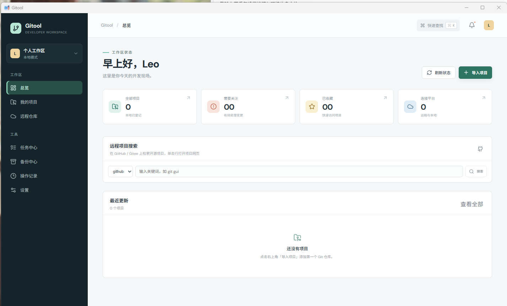
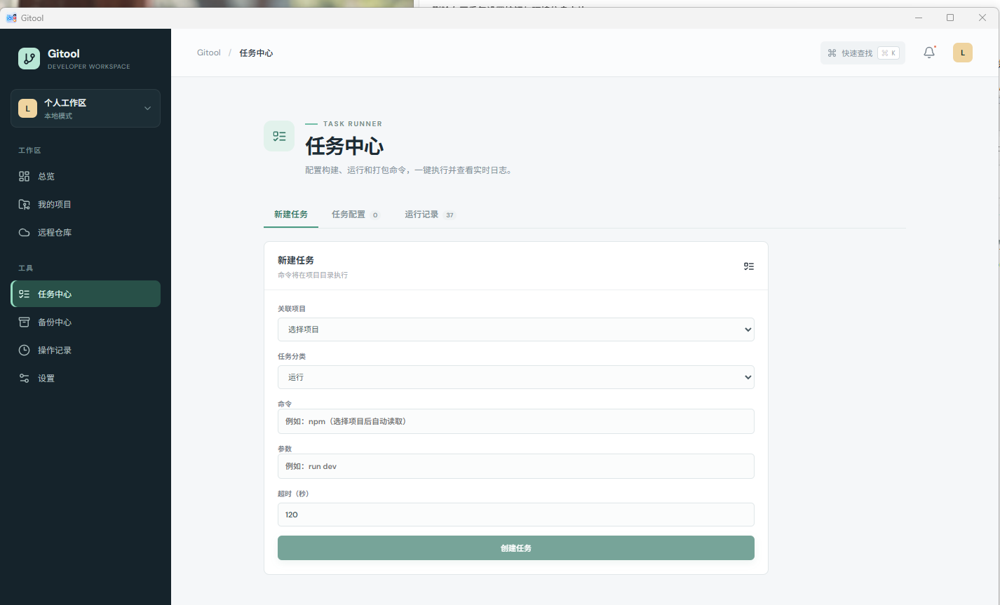
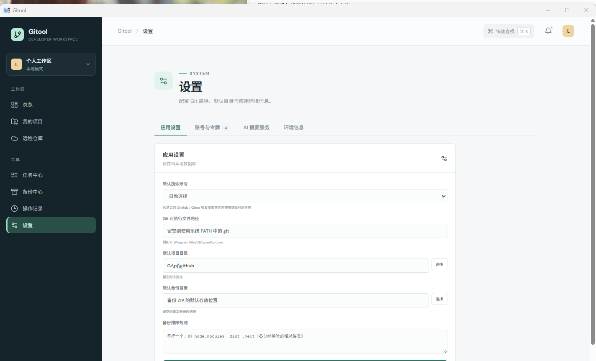

# Gitool

Gitool 是一个 Windows Git 仓库管理桌面工具，统一管理本地仓库以及 GitHub、Gitee、GitLab 远程仓库。





## 功能概览

### 工作区

- **多工作区**：创建、切换、重命名、删除工作区，项目按工作区隔离，重启自动恢复上次活动工作区。
- **总览页**：工作区指标看板（项目数 / 需要关注 / 已收藏 / 连接平台），需要关注面板，最近更新项目列表，GitHub / Gitee 远程项目搜索（支持选择默认搜索账号、搜索结果收藏与单击打开仓库网页）。
- **我的项目页**：项目列表与详情面板，按全部 / 已收藏 / 需要关注筛选，按标签筛选，搜索，批量 fetch / pull / push，项目移除（不删除原目录），收藏与关注的远程项目自动出现在对应筛选中。

### 远程仓库

- **账号同步**：从 GitHub、Gitee、GitLab 读取当前账号可访问的仓库列表，支持分页与本地缓存。
- **远程仓库管理**：创建、编辑、删除远程仓库，设置可见性和描述。
- **克隆**：选择目录克隆远程仓库，实时显示克隆进度。
- **收藏与关注**：点击收藏（★）或关注（♥）调用平台 API（star / watch），同时将远程项目加入本地「我的项目」对应列表，取消操作时同步移除。
- **项目搜索**：总览页内置 GitHub / Gitee 项目搜索，选择平台下拉后输入关键词检索，结果可直接收藏或克隆。

### 任务中心

- **选项卡布局**：新建任务 / 任务配置 / 运行记录三个选项卡。
- **命令自动检测**：选择项目后自动读取 package.json / Cargo.toml / go.mod / pom.xml / build.gradle / .csproj / Dockerfile 中的可用命令，分类为构建、运行、打包、部署。
- **命令中文注释**：每个检测到的命令和参数都附带中文用途说明。
- **任务名称自动生成**：默认使用项目名称，同一项目重复创建时自动追加序号。
- **实时日志**：运行任务后实时推送输出，支持停止和超时。

### 备份中心

- 将项目（含 .git 历史）打包为 ZIP 归档，支持备份排除规则。
- 从 ZIP 恢复到指定空目录，恢复后可直接导入。

### 设置

- **应用设置**：默认搜索账号、Git 路径、默认项目目录、默认备份目录、备份排除规则。
- **账号与令牌**：仅需选择平台 + 输入令牌，用户名由 API 自动读取；同一平台同一用户名重复添加时替换旧令牌；令牌存入 Windows 凭据管理器。
- **AI 摘要服务**：OpenAI 兼容 API Key、模型、接口地址，Key 存入凭据管理器。
- **环境信息**：Git 可用性、版本、操作系统、数据目录。

### Git 操作

- fetch / pull / push / sync，带操作记录。
- 分支创建、切换、删除。
- 变更文件查看、暂存、取消暂存、提交。
- 提交历史时间线视图。
- Git 标签创建、删除。
- 版本对比（提交 / 分支 / 标签），diff 查看。
- 冲突一键暂存向导。
- 远程地址查看与更新。

### 操作记录

- 记录所有 Git 操作、克隆、提交的结果与详情。
- 按结果（成功 / 失败）、操作类型、关键词筛选。
- 导出 CSV，清空记录。

## 架构

| 层 | 实现 |
| --- | --- |
| 桌面壳 | Electron 44（内置 Node.js 24） |
| 渲染层 | React 19 + TypeScript + Vite 8 |
| 主进程 | Node.js + TypeScript，构建产物 `dist-electron/` |
| IPC | `contextBridge` + `ipcRenderer.invoke` / `ipcMain.handle` |
| 数据库 | `node:sqlite`（内置，无原生编译） |
| 凭据 | `@napi-rs/keyring`（Windows Credential Manager） |
| Git | `node:child_process` 调用系统 Git CLI |
| 打包 | electron-builder（NSIS x64 安装包） |

## 开发环境

- Windows 10 22H2 或 Windows 11 x64
- Node.js 24+
- npm 11+
- Git 2.x

无需安装 Rust、Visual Studio Build Tools 或 WebView2。

如果所在网络无法直连 GitHub，可在安装 Electron 二进制时使用镜像：

```powershell
$env:ELECTRON_MIRROR = "https://npmmirror.com/mirrors/electron/"
node node_modules/electron/install.js
```

## 常用命令

```powershell
npm install          # 安装依赖
npm run dev          # 启动 Electron 桌面应用（含主进程热重启与渲染层 HMR）
npm run dev:web      # 仅浏览器预览，使用演示数据
npm run typecheck    # 渲染层与主进程类型检查
npm run build        # 构建 dist/ 与 dist-electron/
npm run dist         # 构建并生成 NSIS 安装包到 release/
```

浏览器预览不会访问系统 Git、SQLite、Windows Credential Manager 或远程平台 API。

打包时如需镜像：

```powershell
$env:ELECTRON_MIRROR = "https://npmmirror.com/mirrors/electron/"
$env:ELECTRON_BUILDER_BINARIES_MIRROR = "https://npmmirror.com/mirrors/electron-builder-binaries/"
npm run dist
```

## 数据与安全

- 项目和账号元数据保存到 Electron `userData` 目录中的 `gitool.sqlite3`。
- PAT 和 AI API Key 使用 Windows Credential Manager 保存，不写入 SQLite。
- Token 不写入远程 URL、操作日志或界面状态。
- Git 操作通过参数数组直接调用系统 Git，不经过 shell。
- 渲染层启用 `contextIsolation`、`sandbox`，禁用 `nodeIntegration`，仅暴露白名单桥接方法。
- 生产环境启用严格 CSP；主进程校验所有 IPC 入参。
- 结构分析默认忽略 `.git`、`node_modules`、`target`、`dist` 等目录。

## 项目结构

```
├── build/              # 图标资源（icon.png / icon.ico）
├── dist/                # Vite 构建产物（渲染层）
├── dist-electron/       # Electron 构建产物（主进程 + preload）
├── docs/                # 需求文档与验收报告
├── electron/
│   ├── main/
│   │   ├── index.ts     # 主进程入口（窗口、托盘、IPC 注册）
│   │   ├── ipc.ts       # IPC handler 注册与入参校验
│   │   └── services/    # 后端服务（storage / providers / git / analysis / ...）
│   └── preload/
│       └── index.ts     # contextBridge 桥接层
├── public/              # 静态资源（favicon）
├── shared/
│   └── types.ts         # 前后端共享类型定义
├── src/
│   ├── App.tsx          # 渲染层主组件
│   ├── lib/             # 前端工具（bridge / projects / workspaces）
│   └── types.ts         # 类型重导出
├── electron-builder.yml # 打包配置
├── package.json
├── tsconfig.json
└── vite.config.ts
```

完整产品需求见 [docs/requirements.md](docs/requirements.md)。

## 当前限制

- OAuth 授权登录尚未接入，当前仅支持 Personal Access Token。
- GitLab 平台暂不支持关注（watch）操作。
- 远程仓库列表不支持按语言、大小等条件排序。
- AI 摘要服务需要自行配置 API Key 和接口地址。
